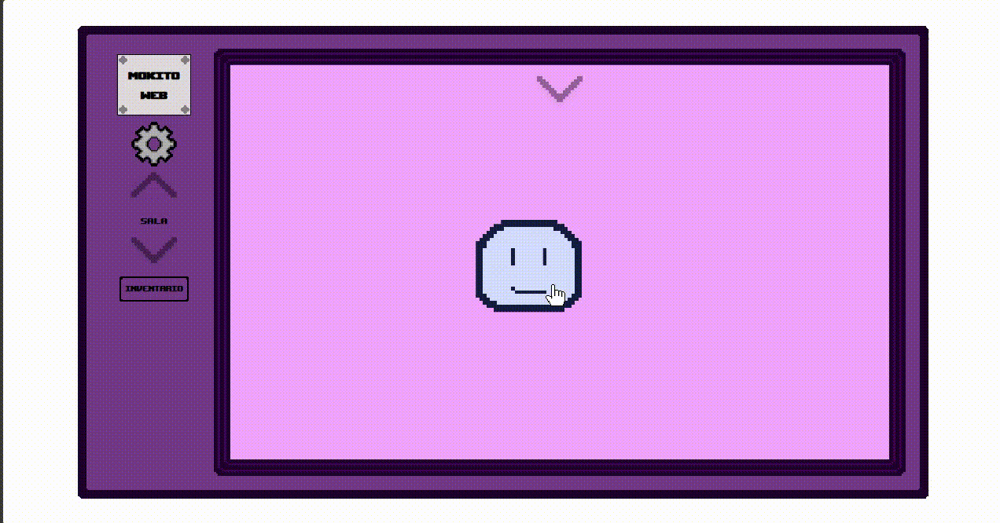

# 🐾 Mokito-Web


Mokito-Web es un juego de mascotas virtuales (Tamagotchi) desarrollado con Angular y TailwindCSS. ¡Cuida de tu adorable mascota virtual Mokito en diferentes habitaciones de la casa!.

Aun la aplicacion esta en fase muy temprana y aun faltan por implementar muchas funciones puedes probarlo [aquí](https://sam324sam.github.io/Mokito-web/)

</img>

## ✨ Características

- **🐶 Mascota Virtual Interactiva** - Mokito responde a tus interacciones con animaciones y comportamientos únicos
- **🏠 Multiple Habitaciones** - Explora el baño, dormitorio, salón y jardín
- **📊 Sistema de Estadísticas** - Administra el hambre, felicidad, higiene y energía de tu mascota
- **🎨 Personalización** - Cambia los colores de la interfaz y configura la experiencia a tu gusto
- **🎮 Modo Cheats** - Experimenta con opciones de depuración y
- **📦 Sistema de Inventario** - Usa objetos para cuidar de Mokito
- **⚡ Sistema de Física** - Implementación propia de física para interacciones realistas
- **🎨 Sprites Animados** - Sprites personalizados con animaciones suaves

## 🚀 Instalación

```bash
# Clonar el repositorio
git clone https://github.com/tu-usuario/Mokito-web.git

# Entrar al directorio
cd Mokito-web

# Instalar dependencias
npm install

# Iniciar el servidor de desarrollo
ng serve --host 0.0.0.0
```

## 🏗️ Arquitectura del Proyecto

```
src/
├── app/
│   ├── component/           # Componentes reutilizables
│   │   ├── configuration-modal/    # Configuración del juego
│   │   ├── header/                 # Cabecera con estadísticas
│   │   ├── inventory-modal/        # Inventario de objetos
│   │   ├── room-button/            # Botones de navegación
│   │   └── stats-bar/              # Barra de estadísticas
│   ├── guards/              # Guards de Angular
│   ├── models/              # Modelos de datos
│   │   ├── entity/          # Entidades del juego
│   │   ├── object/          # Objetos interactuables
│   │   ├── particle/        # Sistema de partículas
│   │   ├── pet/              # Modelo de la mascota
│   │   ├── room/            # Modelo de habitaciones
│   │   └── sprites/         # Modelos de sprites y animaciones
│   ├── services/            # Servicios del juego
│   │   ├── animation/       # Servicio de animaciones
│   │   ├── collision/       # Detección de colisiones
│   │   ├── cursor/          # Gestión del cursor
│   │   ├── data/            # Persistencia de datos
│   │   ├── entity-store/    # Almacén de entidades
│   │   ├── game-loop/       # Bucle principal del juego
│   │   ├── grab/            # Sistema de arrastre
│   │   ├── particle/        # Efectos de partículas
│   │   ├── physics/         # Motor de física
│   │   ├── room/            # Gestión de habitaciones
│   │   └── sprites/         # Carga de sprites
│   └── views/               # Vistas principales
│       └── pet-view/        # Vista principal de la mascota
├── public/                  # Assets estáticos
└── styles/                  # Estilos globales
```

## 🎮 Cómo Jugar

1. **Navega entre habitaciones** usando los botones inferiores
2. **Observa las estadísticas** de Mokito en la cabecera
3. **Usa el inventario** para darle comida, juguetes y más
4. **Configura** la apariencia a tu gusto en el menú de configuración
5. ¡Asegúrate de que Mokito esté siempre feliz, limpio y bien alimentado!

## 🧩 Tecnologías

- **Framework**: Angular 21+
- **Estilos**: TailwindCSS 4.x + SCSS
- **Lenguaje**: TypeScript
- **Despliegue**: GitHub Pages

## 📝 Licencia

Este proyecto está bajo la Licencia MIT.

## Programas usados

### Pixel Art

  <a href="https://github.com/LibreSprite/LibreSprite">
    
  </a>

**LibreSprite**  
Creacion y animacion de sprites en pixel art.

---

### Musica y Sonido

  <a href="https://github.com/YuriSizov/boscaceoil-blue">
    
  </a>

**Bosca Ceoil Blue**  
Creacion de musica y efectos retro.

---

## Autor

<table>
  <tr>
    </td>
      <td align="center">
      <a href="https://github.com/sam324sam">
        <br />
        <sub><b>Samuel Moniz Pereira</b></sub>
      </a><br />
    </td>
  </tr>
</table>
