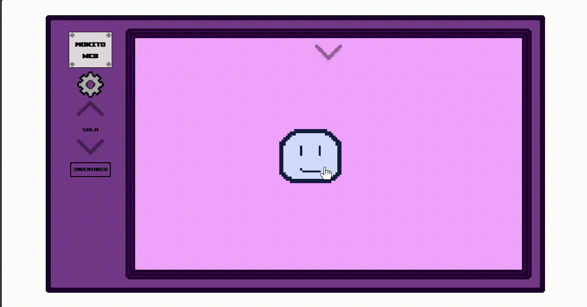
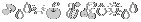

# 🐾 Mokito-Web


Mokito-Web es un juego de mascotas virtuales (Tamagotchi) desarrollado con Angular y TailwindCSS. ¡Cuida de tu adorable mascota virtual Mokito en diferentes habitaciones de la casa!.

Aun la aplicacion esta en fase muy temprana y aun faltan por implementar muchas funciones puedes probarlo [aquí](https://sam324sam.github.io/Mokito-web/)

</img>

## ✨ Características

- **🐶 Mascota Virtual Interactiva** - Mokito responde a tus interacciones con animaciones y comportamientos únicos
- **🏠 Multiple Habitaciones** - Explora el baño, dormitorio, salón y jardín
- **📊 Sistema de Estadísticas** - Administra el hambre, felicidad, higiene y energía de tu mascota
- **🎨 Personalización** - Cambia los colores de la interfaz y configura la experiencia a tu gusto
- **🎮 Modo Cheats** - Experimenta con opciones de depuración y
- **📦 Sistema de Inventario** - Usa objetos para cuidar de Mokito
- **⚡ Sistema de Física** - Implementación propia de física para interacciones realistas
- **🎨 Sprites Animados** - Sprites personalizados con animaciones suaves

## 🚀 Instalación

```bash
# Clonar el repositorio
git clone https://github.com/tu-usuario/Mokito-web.git

# Entrar al directorio
cd Mokito-web

# Instalar dependencias
npm install

# Iniciar el servidor de desarrollo
ng serve --host 0.0.0.0
```

## 🏗️ Arquitectura del Proyecto

```
src/
├── app/
│   ├── component/               # Componentes reutilizables
│   │   ├── configuration-modal/
│   │   │   └── components/
│   │   │       ├── change-sprite/
│   │   │       ├── cheats/
│   │   │       ├── color-selector/
│   │   │       ├── data-config/
│   │   │       ├── debug-pet/
│   │   │       ├── debug-show/
│   │   │       ├── sound-config/
│   │   │       └── user-ui-config/
│   │   ├── console-frame/
│   │   ├── header/
│   │   ├── inventory-modal/
│   │   ├── pet-component/
│   │   ├── room-button/
│   │   └── stats-bar/
│   ├── guards/                  # Guards de Angular
│   │   ├── has-collider.guard.ts
│   │   ├── has-grab.guard.ts
│   │   ├── is-interactuable-object.guard.ts
│   │   ├── is-mesage.guard.ts
│   │   ├── is-particle.guard.ts
│   │   └── is-pet.guard.ts
│   ├── models/                  # Modelos de datos
│   │   ├── entity/             # Entidades del juego
│   │   ├── message/
│   │   ├── object/             # Objetos interactuables
│   │   ├── particle/           # Sistema de partículas
│   │   ├── pet/                # Modelo de la mascota
│   │   ├── player/
│   │   ├── room/               # Modelo de habitaciones
│   │   └── sprites/            # Modelos de sprites y animaciones
│   ├── services/               # Servicios del juego
│   │   ├── animation.service.ts
│   │   ├── collision.service.ts
│   │   ├── cursor.service.ts
│   │   ├── data.service.ts
│   │   ├── entity-store.service.ts
│   │   ├── game-loop.service.ts
│   │   ├── grab.service.ts
│   │   ├── mesage/              # Sistema de mensajes
│   │   ├── particle/            # Efectos de partículas
│   │   ├── pet/                 # Lógica de la mascota
│   │   │   ├── pet-condition/
│   │   │   ├── pet-ia/
│   │   │   ├── pet-input/
│   │   │   ├── pet-stat/
│   │   │   └── pet-state/
│   │   ├── physics.service.ts
│   │   ├── room.service.ts
│   │   ├── sound.service.ts
│   │   ├── sprites.service.ts
│   │   ├── storage/             # Almacenamiento de imágenes
│   │   └── interactable-objects/
│   └── views/                   # Vistas principales
│       ├── console-view/
│       ├── error-view/
│       └── home-view/
├── assets/
│   ├── config/                  # Configuraciones JSON
│   └── sound/                   # Audio del juego
├── index.html
├── main.ts
└── styles.css                  # Estilos globales
```

## 🎮 Cómo Jugar

1. **Navega entre habitaciones** usando los botones inferiores
2. **Observa las estadísticas** de Mokito en la cabecera
3. **Usa el inventario** para darle comida, juguetes y más
4. **Configura** la apariencia a tu gusto en el menú de configuración
5. ¡Asegúrate de que Mokito esté siempre feliz, limpio y bien alimentado!

## 🧩 Tecnologías

- **Framework**: Angular 21+
- **Estilos**: TailwindCSS 4.x + css
- **Lenguaje**: TypeScript
- **Despliegue**: GitHub Pages

## 📝 Licencia

Este proyecto está bajo la Licencia MIT.

## Programas usados

### Pixel Art

  <a href="https://github.com/LibreSprite/LibreSprite">
    
  </a>

**LibreSprite**  
Creacion y animacion de sprites en pixel art.

---

### Musica y Sonido

  <a href="https://github.com/YuriSizov/boscaceoil-blue">
    
  </a>

**Bosca Ceoil Blue**  
Creacion de musica y efectos retro.

---

## Autor

<table>
  <tr>
    </td>
      <td align="center">
      <a href="https://github.com/sam324sam">
        <br />
        <sub><b>Samuel Moniz Pereira</b></sub>
      </a><br />
    </td>
  </tr>
</table>

## Autores de las tipografía

Tipografía de la web: [Ænigma](https://www.dafont.com/aenigma.d188) 

Tipografía de mokito: [Dahaba](https://www.dafont.com/regina-dahaba.d11214) 

> [!WARNING]
> Este proyecto está bajo una licencia personalizada que prohíbe el uso para entrenamiento de inteligencia artificial. Consulta el archivo [LICENSE](LICENSE) para más detalles.